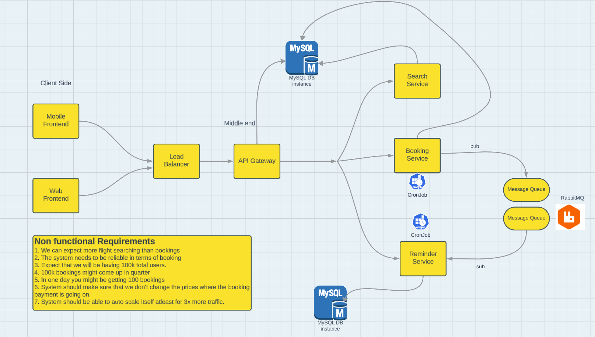
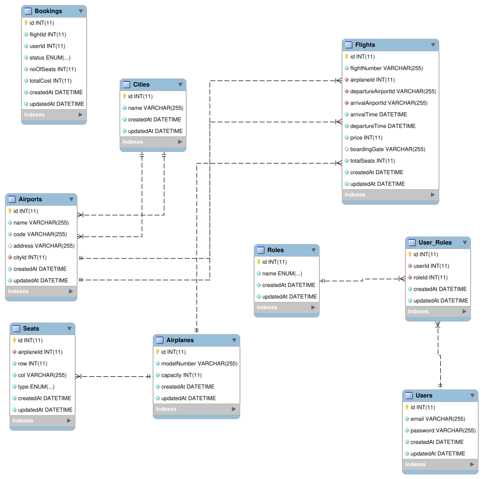
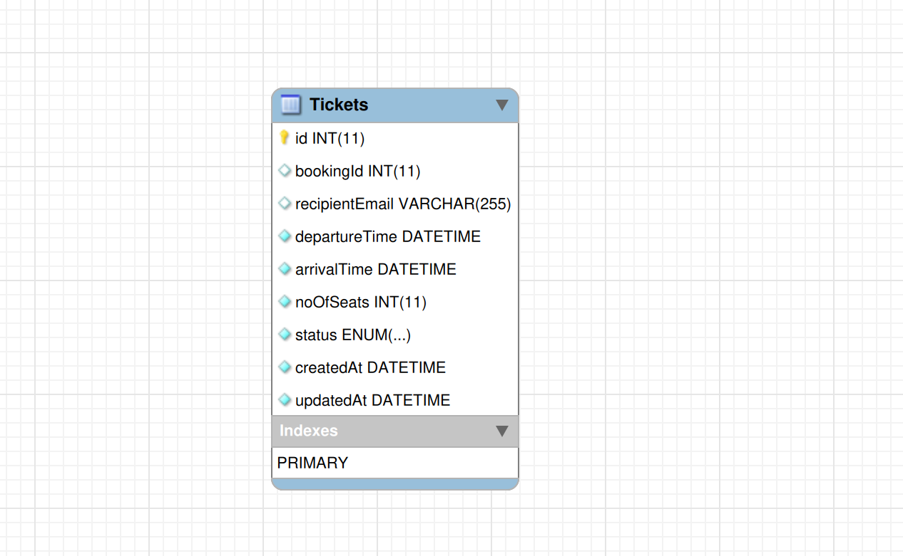

# Flight Booking System

## Description
This is an Airline managemnet and flight booking system based on microservices architecture. It has 4 microservices:
1. Flight Service
2. Booking Service
3. Authentication Service
4. Notification Service

## Non Functional Requirements
Non functional Requirements
1.  We can expect more flight searching than bookings
2.  The system needs to be reliable in terms of booking
3.  Expect that we will be having 100k total users.
4.  100k bookings might come up in quarter
5.  In one day you might be getting 100 bookings
6.  System should make sure that we don?t change the prices where the
    booking payment is going on.
7.  System should be able to auto scale itself atleast for 3x more traffic.

## Design

## ER Diagram

### For Flights DB

### For Notification DB

## Functionalities
1. Flight Service : CRUD operations on all flight db models
2. Booking Service : Book or cancel a booking
3. Notification Service : Send email notifications to users on booking, cancellation. Run CRON jobs to check for        upcoming flights and send notifications.
4. Authentication Service : Signin, Signup, Reverse proxy for Flight Search and Booking Service

## Tech Stack
1.  NodeJS
2.  ExpressJS
3.  MySQL
4.  Sequelize
5.  RabbitMQ
6.  NodeMailer
7.  JWT
